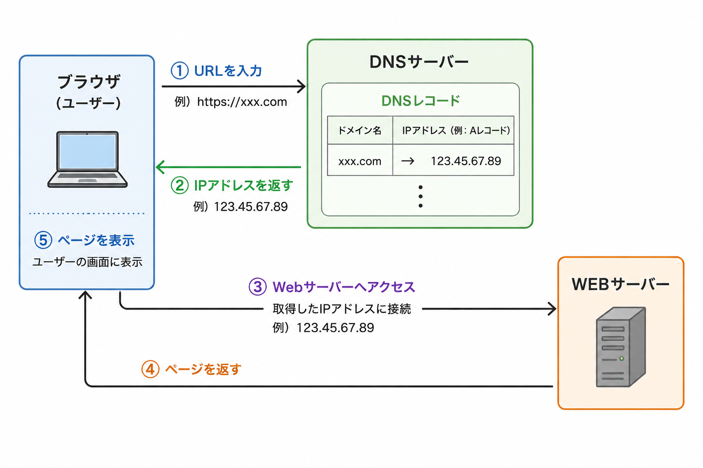
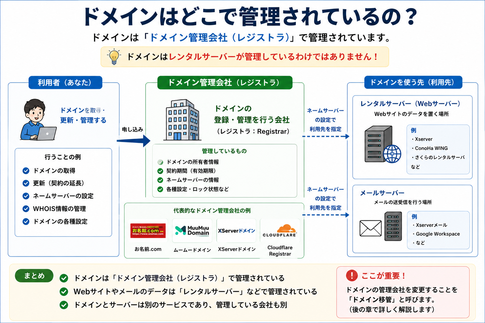
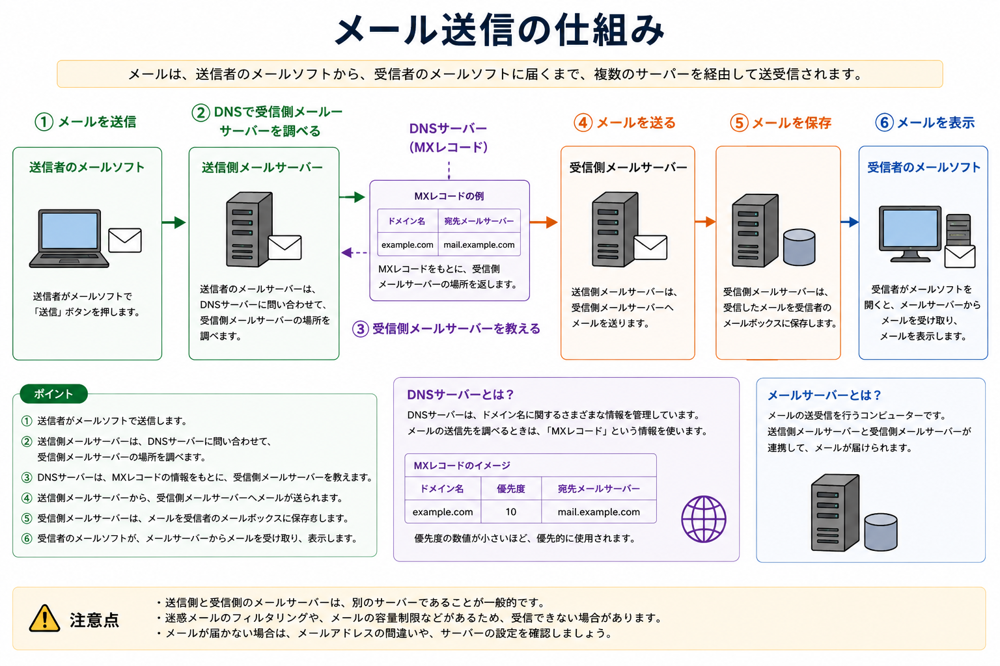

# 【完全保存版】サーバー移転の教科書〜基礎知識から手順まで〜

> 出典: Notion ページ https://wiggly-eel-550.notion.site/3b4f2874df578086b4e5cdea9a6375a4
> 取得日: 2026-08-11 ／ ※現時点で執筆途中（序章のみ完成）

---

本講座では、サーバー、ドメイン、DNS、メールサーバーなどの基礎知識を理解し、
サイトリニューアルに伴うサーバー移転やドメイン移管を混乱なくスムーズに行えるようになることを目指します。

全数回にわたり、まずは基礎知識で土台を固めた上で、サーバー移転の考え方や注意点を学び、最終的に具体的な移転手順を実践します。

---

## ■講座の全体像

本講座では、**サーバー移転とドメイン移管を、まずは別々のものとして理解していきます。**

この2つはとても混同されやすいのですが、まったく別の作業です。
だからこそ、それぞれを単体でしっかり理解したうえで、最後に「両方いっぺんにやる場合」を扱います。

### ✓ 序章：前提となる基礎知識編

1. Webページが表示される仕組み
2. ドメインはどこで管理されている？
3. メールサーバーとはなにか？
4. 一般的なレンタルサーバーで提供されているもの

### ✓ １章：サーバー移転（知識編）

1. サーバー移転（引っ越し）とは？
2. 移転の前に、必ず確認すること
3. ネームサーバーごと、丸ごと引っ越す
4. Webだけ引っ越す（メールを移さない場合）
5. サーバー移転の全体の流れ
6. サーバー移転でよくある失敗やトラブル

### ✓ ２章：ドメイン移管（知識編）

1. ドメイン移管とは？
2. 混同しやすい３つを切り分ける
3. 移管できない・危ないケース
4. ドメイン移管の全体の流れ
5. 移管で何が変わる／変わらない
6. ドメイン移管でよくあるトラブル

### ✓ ３章：サーバー移転（手順編）

### ✓ ４章：ドメイン移管（手順編）

### ✓ ５章：サーバー移転＋ドメイン移管（複合版）

> **知識編と手順編のちがい**
> **知識編（1章・2章）** … 机上での解説です。手順の流れも一通り解説するので、読めば全体像がつかめる状態を目指します。
> **手順編（3章・4章）** … 実際の管理画面に沿って、操作を解説していきます。

---

# 序章｜前提となる基礎知識編

サーバー移転やドメイン移管の話に入る前に、まずは前提となる基礎知識を理解しておきましょう。

この章では、

1. Webページが表示される仕組み
2. ドメインはどこで管理されている？
3. メールサーバーとはなにか？
4. 一般的なレンタルサーバーで提供されているもの

について解説していきます。

---

## 1｜Webページが表示される仕組み

### ■Webページ表示の流れ

まずは、普段私たちが見ているWebページが、どのような仕組みで表示されているのかを見ていきましょう。

ブラウザで `example.com` のようなURL（ドメイン）を入力すると、画面にサイトが表示されますね。
このとき、裏側では何が起きているのでしょうか。流れはこんな感じ。

1. ブラウザにURL（**`ドメイン`**）を入力する
2. そのドメインの **`ウェブサーバー`** にアクセスしにいく
3. そのサーバーの中に、サイトのデータ（WordPressなど）が保存されている
4. データがブラウザに返ってきて、画面に表示される

> **ポイント**
> サイトの中身（WordPressなどのデータ）は、**ウェブサーバー**という場所に置いてあります。
> ブラウザは「そのサーバーにデータを取りに行っている」だけ、とイメージしてください。

---

### ■ドメインだけでは、サーバーを見つけられない

ここで1つ、大事な事実があります👀

それは、

```text
＿人人人人人人人人人人人人人人人人人人人人人人人人人人人人人人人人＿
＞　ドメインの名前だけでは「どのウェブサーバーか」を特定できない　＜
￣Y^Y^Y^Y^Y^Y^Y^Y^Y^Y^Y^Y^Y^Y^Y^Y^Y^Y^Y^Y^Y^Y^Y^Y^Y^Y^Y￣
```

ということです。

なぜなら、ウェブサーバーは名前ではなく、**`IPアドレス`** という「住所」で管理されているからです。

- **ドメイン** … 家の「表札」（例：橋本。ドメインは、`example.com`）
- **IPアドレス** … 家の「住所」（例：東京都東大和市＊＊3-…(ﾅｲｼｮ)。IPは、`192.0.2.10` のような数字）

私たちは名前（ドメイン）しか入力していないのに、ちゃんと住所（IPアドレス）にたどり着けているということになるんですねー。

### ちゅーことは….

どこかで **「ドメイン（名前）」と「IPアドレス（住所）」を結びつけている** わけであります。

---

### ■ その紐付けをするのが「DNS」

この「名前 → 住所」の変換をしてくれるのが **DNS** という仕組みなんです。

※DNS → Domain Name System → 難しそうと思いきや、意外と単純なネーミング！😂
ドメインのお名前の仕組み

DNSは、いわば **住所録のような役割** だと思ってください。

> 「橋本」→住所は「東京都東大和市＊＊３−３\*\*\*\*\*−２０２」
> 「`example.com`」 → 住所は「 `192.0.2.10` 」

こういった対応表を持っていて、ブラウザに「この人の住所はここですよ」と示されてるわけですね。

この対応表（１行）のことを、**DNSレコード** なんていったりします。

---

### ■その住所録（DNSレコード）を置いてあるのが「ネームサーバー（DNSサーバー）」

DNSレコードは、**ネームサーバー（DNSサーバー）** というところに保管されております。

---

### いったんまとめ！



---

## 2｜ドメインはどこで管理されているの？

ドメインは **ドメイン管理会社** で管理されています。サーバーとは別の場所で管理されてるわけです。

例えば、

- お名前.com
- ムームードメイン
- XServerドメイン（エックスドメイン）

などがあります。

==ドメイン管理会社のことを「`レジストラ`」と呼んだりします！==

この知識は、のちほど解説する「ドメイン移管」に直結するので覚えておきましょー！



---

## 3｜メールサーバーとは？ 〜メール送信の仕組みを理解しよう〜

メールは、送信者のパソコンから受信者のパソコンへ直接届くわけではありません。
送信側と受信側の `メールサーバー` を経由して届けられます。

---

### ■メールが届くまでの流れ

メールは、次の順番で届きます。

```text
送信者のメールソフト
　　　↓
送信側メールサーバー
　　　↓
DNSサーバー（MXレコード）
　　　↓
受信側メールサーバー
　　　↓
受信者のメールソフト
```

---

### ■① 送信者がメールを送信する

送信者がメールソフトでメールを作成し、「送信」ボタンを押します。
すると、メールは最初に **送信側メールサーバー** へ送られます。

---

### ■② 送信側メールサーバーが届け先を調べる

送信側メールサーバーは、宛先メールアドレスを確認します。
例えば、次のメールアドレスへ送るとします。

```text
info@example.com
```

この場合、メールサーバーは

```text
example.com
```

というドメインを確認します。

そして、

> 「example.com宛てのメールは、どのメールサーバーへ送ればよいのだろう？」

という問い合わせを `DNSサーバー` へ行います。

---

### ■③ DNSサーバーが受信側メールサーバーを教える

DNSサーバーには、メールの届け先が **MXレコード** として登録されています。

例えば、

```text
example.com
　　　↓
mail.example.com
```

という情報が登録されていれば、DNSサーバーは

> 「mail.example.com に送ってください」

という情報を送信側メールサーバーへ返します。

---

### ■④ 送信側メールサーバーがメールを送る

送信側メールサーバーは、DNSから教えてもらった受信側メールサーバーへメールを送ります。
この時点では、まだ受信者のパソコンには届いていません。

---

### ■⑤ 受信側メールサーバーがメールを保存する

受信側メールサーバーは、届いたメールを受信者のメールボックスへ保存します。
つまり、メールはまずメールサーバーに保管されます。

---

### ■⑥ 受信者がメールを確認する

受信者がメールソフトを開くと、メールソフトが受信側メールサーバーへ接続します。
メールサーバーに保存されているメールを取得し、画面に表示します。
これでメールを読むことができます。

---

### ここが重要

メールは、

- パソコン → パソコン

ではなく、

- メールソフト
- 送信側メールサーバー
- DNSサーバー
- 受信側メールサーバー
- メールソフト

という流れで届けられます。

---

## いったんまとめ！



---

## 4｜一般的なレンタルサーバーで提供されているもの

一般的なレンタルサーバーを契約すると、以下がセットで提供されます

- Webサーバー
- DNSサーバー
- メールサーバー

なにが言いたいかというと、サーバーを引っ越すとはつまり、上記の３種類のサーバーをまるっと引っ越す のが通常です。

***※必ずそうしなきゃいけないわけではありません。あくまで一般論といった感じです***

> たとえば、メールサーバーは引っ越さない とか、DNSサーバーは今のまま とか、も可能っちゃ可能です

### 💡補足知識！

**レンタルサーバー会社とドメイン管理会社は、同じ会社の場合もあれば、別の会社の場合もあります。**

例えば、

- Xserverでサーバーを契約し、お名前.comでドメインを管理する

というケースもあれば、

- Xserverでサーバーを契約し、XServerでドメインを管理する

というケースもあります。

---

<!-- ここまでが Notion 側の執筆済み範囲（序章／講座実施済み）。以降は 2026-08-11 に追記。 -->

# 第1章｜サーバー移転（知識編）

序章では、レンタルサーバーには「Webサーバー」「DNSサーバー」「メールサーバー」の3つがセットで入っている、という話をしました。

この章では、その3つを実際にどう動かすのかを見ていきます。

この章では、

1. サーバー移転（引っ越し）とは？
2. 移転の前に、必ず確認すること
3. ネームサーバーごと、丸ごと引っ越す
4. Webだけ引っ越す（メールを移さない場合）
5. サーバー移転の全体の流れ
6. サーバー移転でよくある失敗やトラブル

について解説していきます。

---

## 1｜サーバー移転（引っ越し）とは？

### ■まず、いちばん大事な話から

サーバー引っ越しとドメイン移管は全く別物です。
ここではあくまでドメインの管理会社はそのままで、サーバーだけ引っ越すというところに絞ってお話しします。

.

序章を思い出してください。ドメインは家の「表札」、サーバーは「住所」でした。
サーバー移転でやっているのは、**表札はそのままで、表札に書いてある住所だけを書き換える**作業なんです。

.

> **ポイント**
> サーバー移転とは、ドメインを動かすことではありません。
> **ドメインの向き先を、新しいサーバーに変えること**です。

.

---

### ■移転で動かすもの

サーバー移転で実際に動かすのは、次の3つです。

1. **サイトのデータ** … WordPress本体・テーマ・画像・データベース
2. **DNSの向き先** … ネームサーバーの設定、またはAレコード
3. **メールの受け皿** … 移す場合のみ

---

### ■データをコピーしただけでは、何も起きない

ここも大事なポイントです。

新サーバーにサイトのデータをコピーしても、**その瞬間には何も起きません。**
訪問者はまだ旧サーバーを見ています。だってDNSがまだ旧サーバーの住所を教えているんですから。

```text
データのコピー　→　何も起きない（＝準備）
DNSの切り替え　→　ここで世界が入れ替わる（＝本番）
```

つまり、サーバー移転の本番は、**DNSを切り替えるこの一点だけ**なんですね。


---

## 2｜移転の前に、必ず確認すること

### ■まず「メールを使っているか」を確認する

サーバー移転で最初にやるべきことは、データの移行ではありません。

**そのドメインでメールを使っているかどうかを確認することです。**

ここを確認しないまま作業を進めてしまうのが、サーバー移転でいちばん危険なパターンです。


> **ポイント**
> サーバー移転で事故りやすいのは、「メール」！
> 使用有無を確認しないまま丸っと移転すると、メールが見れなくなるというトラブルが起きちゃいます

---

### ■確認すること

- **そのドメインのメールアドレスを使っているか**（`info@example.com` など）
- 使っている場合、**どこのメールサーバーを使っているか**
  - いま契約しているレンタルサーバーのメール機能
  - Google Workspace や Microsoft 365 などの外部サービス
- **メールアドレスの一覧**と、それぞれ誰が使っているか
- そのアドレスが**どこで使われているか**（パソコンのメールソフト、スマホ、フォームの送信元 など）

.
まとめると、以下を抑えておく必要があります
- メールの使用有無
- メールアドレスの一覧
- どのメールサーバーを使っているか
- クライアント側で使っているメールソフト
.
---

### ■確認できたら、この流れで判断する

メールの状況が分かれば、あとはこの流れで決まります。

```text
そのドメインでメールを使っている？
│
├─ 使っていない
│    → ネームサーバーごと丸ごと引っ越す（→ 3節へ）
│
└─ 使っている
     → メールサーバーも新サーバーに移す？
        │
        ├─ 移す
        │    → ネームサーバーごと丸ごと引っ越す（→ 3節へ）
        │
        └─ 移さない（旧サーバーや外部サービスのまま使う）
             → Webだけ引っ越す（→ 4節へ）
```

> **ポイント**
> 判断すべきことは1つだけ。**メールサーバーも一緒に移すのかどうか。**
> ここが決まれば、DNSの触り方は自動的に決まります。

---

## 3｜ネームサーバーごと、丸ごと引っ越す

### ■どんなときに選ぶのか

次の2つのケースです。

1. **メールを使っていない場合**
2. **メールを使っていて、そのメールも新サーバーに移す場合**


---

### ■やり方

レジストラ（ドメイン管理会社）で、ネームサーバーの設定を新サーバーのものに書き換える。
たったこれだけで、Web・DNS・メールが**まとめて**新サーバーに移ります。

```text
【切り替え前】
ドメイン　→　旧サーバーのネームサーバー　→　旧サーバーのWeb／メール

【切り替え後】
ドメイン　→　新サーバーのネームサーバー　→　新サーバーのWeb／メール
```

> **ポイント**
> 管理する場所が1か所にまとまるので、あとあとの運用もラクになります。
> 特別な事情がなければ、こちらが基本の形です。

---

### ■ひとつ注意点あり（詳細は後述）

丸ごと引っ越しが安心なのは、**いまのDNSレコードがシンプルな場合**です。

すでに、

- サブドメインを外部サービスに向けている（`shop.example.com` → ネットショップ など）
- Google Workspace などの外部のメールサービスを使っている
- メール認証（SPFなど）の設定を入れている

といった場合、ネームサーバーを切り替えると**それらの設定が新サーバーに引き継がれません。**

ここは事故がとても多いところなので、後の章でまとめてじっくり解説します。
いまの段階では、

> **DNSレコードをいろいろ設定している場合、丸ごと引っ越しは要注意**

とだけ覚えておいてください。

---

## 4｜Webだけ引っ越す（メールを移さない場合）

### ■どんなときに選ぶのか

メールを使っていて、**そのメールは移さない**と判断した場合です。
理由は基本的に2つだけです。

1. **旧サーバーのメールを使い続けたい**
2. **Google Workspaceなどの外部メールを使っている**

サイトは新サーバーに移したいけれど、メールまわりはいまのまま触りたくない。そういうケースですね。

---

### ■やり方

ネームサーバーは**変えません。** いまのまま。
そのゾーンの中の、**Aレコードだけを新サーバーのIPアドレスに書き換えます。**

```text
【変える】
example.com　　A　　旧サーバーのIP　→　新サーバーのIP
www　　　　　　A　　旧サーバーのIP　→　新サーバーのIP

【いっさい触らない】
example.com　　MX　　旧サーバーのまま
その他のレコード　　　　旧サーバーのまま
```

Webの向き先だけが変わり、メールもその他の設定もそのまま生き残ります。

> **ポイント**
> Aレコードだけを書き換える方式は、**既存のレコードを一切壊さない**のが最大のメリットです。
> DNSの設定が複雑な案件では、こちらのほうが安全です。

---

### ■デメリットもあるので、クライアントにも理解して頂く必要があります

- **旧サーバーを解約できない** … メールとDNSが旧サーバーに残るので、契約を維持し続けることになります
- **管理場所が2か所に分かれる** … Webは新サーバー、メールとDNSは旧サーバー
- **引き継ぎで混乱しやすい** … この構成を説明しておかないと、後任の担当者が必ず混乱します

---

### ■メールサーバーを引っ越すかどうかで、すべてが決まる

あらためて、2つを並べて比べてみましょう。

| | メールサーバーも引っ越す | Webだけ引っ越す |
|---|---|---|
| **メールの状況** | 使っていない／新サーバーに移す | 旧サーバーや外部サービスのまま使う |
| 変えるもの | ネームサーバー | Aレコードだけ |
| 移るもの | Web・DNS・メール | Webだけ |
| 既存のDNSレコード | 引き継がれない（要注意） | そのまま残る |
| 旧サーバーの解約 | できる | **できない** |
| 管理場所 | 1か所 | 2か所 |

> **ポイント**
> 移転の方法を選んでいるのではありません。
> **「メールサーバーを引っ越すか」を決めた結果として、方法が決まる**のです。

<!-- 図の差し込み位置：「メールサーバーも引っ越す」と「Webだけ引っ越す」の対比図 -->

---

## 5｜サーバー移転の全体の流れ

実際の管理画面の操作は3章で解説します。
ここでは、**流れだけ**を頭に入れてください。

```text
① 移転先サーバーを契約する
② 新サーバーにドメインを追加する
③ サイトのデータを移行する
④ hostsファイルで、新サーバーの表示を確認する
⑤ 新サーバーでSSL証明書を発行する
⑥ DNSを切り替える　← ここが本番
⑦ 反映を待って、検証する
⑧ 旧サーバーを解約する
```

---

### ■① 移転先サーバーを契約する

移転先のサーバーを契約します。この時点ではまだ何も起きません。

---

### ■② 新サーバーにドメインを追加する

新サーバー側に「このドメインを受け入れる準備」をします。
このとき、**まだDNSは切り替えません。**

---

### ■③ サイトのデータを移行する

Xserverなら「WordPress簡単移行」が使えます。
手動でやる場合は、FTPでファイルを、phpMyAdminでデータベースを移します。

---

### ■④ hostsファイルで、新サーバーの表示を確認する

**移転でいちばん大事なステップです。**

hostsファイルは、自分のパソコンだけに効く「DNSの上書き設定」のようなもの。
ここに「`example.com` は新サーバーのIP」と書いておくと、**自分のパソコンだけが新サーバーを見に行きます。** ほかの人にはまったく影響しません。

つまり、**DNSを切り替える前に、本番と同じURLで新サーバーの表示を確認できる**わけです。

> **ポイント**
> hostsで確認　→　問題なし　→　はじめてDNSを切り替える。
> この順番を守れば、「切り替えた瞬間にサイトが真っ白」という事故は防げます。

---

### ■⑤ 新サーバーでSSL証明書を発行する

切り替え前に、新サーバー側でSSLを有効にしておきます。
これを忘れると、切り替えた瞬間に「保護されていない通信」の警告が出ます。

---

### ■⑥ DNSを切り替える

いよいよ本番です。
「丸ごと引っ越し」ならネームサーバーを、「Webだけ引っ越し」ならAレコードを書き換えます。

---

### ■⑦ 反映を待って、検証する

反映には数時間〜48時間かかることがあります。
そしてこの期間、**新サーバーが見える人と旧サーバーが見える人が混在します。**

なので、この期間は次の点に注意してください。

- **記事の投稿・更新をしない**（旧サーバー側に書いてしまうと消えます）
- **お問い合わせフォームの内容が旧サーバーに入る可能性がある**

理想は、アクセスの少ない時間帯に切り替えて、クライアントにも「この期間は更新しないでください」と事前に伝えておくことです。

検証する項目はこのあたり。

- トップページ・下層ページの表示
- https（SSL）が有効か
- お問い合わせフォームの送信テスト
- 管理画面にログインできるか
- メールの送受信テスト（移した場合）
- サブドメインがある場合は、それも忘れずに

---

### ■⑧ 旧サーバーを解約する

**すぐには解約しないでください。** 最低2週間〜1か月は残しておきます。

理由は3つ。

- 反映が完全に終わるまで時間がかかる
- 移行漏れが後から見つかることがある
- 何かあったときの切り戻しの保険になる

---

### ■メールも移す場合に増える作業

- 新サーバーでメールアカウントを作成する（②〜③のあたりで）
- 過去のメールデータを移行する（必要な場合）
- **切り替え後、クライアントのメールソフトの設定を変更する** ← 忘れがち！
- 切り替え中は、メールが新旧どちらのサーバーに届くか分からない期間がある

---

## 6｜サーバー移転でよくある失敗やトラブル

### ■① 旧サーバーをすぐ解約して、メールが消えた

いちばん取り返しがつかないパターンです。
メールのデータは旧サーバーにあるので、解約すると消えます。**復旧できません。**

---

### ■② 反映中の投稿・お問い合わせが旧サーバーに入って消えた

⑦で書いたとおりです。切り替え期間中は更新を止めるのが正解。

---

### ■③ SSLを発行する前に切り替えて「保護されていない通信」になった

新サーバーでSSLを有効にする前にDNSを切り替えると、これが起きます。
クライアントからの信頼を一気に失うので気をつけましょう。

---

### ■④ PHPバージョンの違いでエラーになった

旧サーバーがPHP 7系、新サーバーがPHP 8系。
これでプラグインやテーマが動かなくなることがあります。
移転前に、旧サーバーと新サーバーのPHPバージョンを確認しておきましょう。

---

### ■⑤ メールアカウントのパスワードが分からなくなった

新サーバーでメールアカウントを作り直すとき、パスワードを同じにできないと、
クライアント側のメールソフトの設定を全部変更してもらうことになります。

メールアカウントのパスワードは、**旧サーバーの管理画面では確認できないことが多い**です。
事前にクライアントに確認しておきましょう。

---

### ■⑥ ネームサーバーを切り替えたら、既存のDNSレコードが消えた

これは**サーバー移転でもっとも多く、そしてもっとも気づきにくい事故**です。

サイトは正常に表示されているのに、

- メールが届かなくなった
- サブドメインが表示されなくなった
- 送ったメールが相手の迷惑メールフォルダに入るようになった

といった形で、あとから発覚します。

> **サイトが表示された＝移転成功、ではありません。**

とても重要な内容なので、後の章でまとめてじっくり解説します。

---

# 第2章｜ドメイン移管（知識編）

1章では「ドメインは引っ越さない」という話をしました。
この章では、その"引っ越さない"はずのドメインを扱う **ドメイン移管** の話をします。

この章では、

1. ドメイン移管とは？
2. 混同しやすい３つを切り分ける
3. 移管できない・危ないケース
4. ドメイン移管の全体の流れ
5. 移管で何が変わる／変わらない
6. ドメイン移管でよくあるトラブル

について解説していきます。

---

## 1｜ドメイン移管とは？

### ■レジストラを変えるだけ

序章で、ドメインは「ドメイン管理会社（レジストラ）」で管理されている、という話をしました。

**ドメイン移管とは、この管理会社を変えることです。**

たとえば、お名前.comで管理していた `example.com` を、Xserverドメインに移す。これが移管です。

変わるのは管理会社だけ。

- ドメイン名は変わらない
- 所有者（持ち主）も変わらない
- サイトも落ちない（正しくやれば）

---

### ■サーバー移転とは、まったく別の作業です

1章で「ドメインは引っ越さない」と書きました。もう一度言います。

> **ドメイン移管をしなくても、サーバー移転は完結します。**

この2つを並べて整理しておきましょう。

| | 何をすること |
|---|---|
| **サーバー移転** | サイトの置き場所を変える |
| **ドメイン移管** | ドメインの管理会社を変える |

この2つは無関係です。片方だけやってもいいし、両方やってもいい。

---

### ■じゃあ、なぜ移管するのか

理由はだいたいこのあたりです。

- **管理を1社にまとめたい** … サーバーとドメインが別会社だと、管理画面を行き来することになる
- **更新料が安い会社に移したい**
- **クライアントが管理していたドメインを、自分の管理下に引き継ぐ**
- 逆に、自分が管理していたドメインをクライアントに渡す
- 現在の管理会社の管理画面が使いづらい

逆に言うと、**特に理由がなければ移管しなくていい**んです。
移管には事故のリスクがあるので、必要がないならやらないのも立派な判断です。


---

## 3｜移管できない・危ないケース

ドメイン移管には条件があります。
以下に当てはまる場合、移管できないか、やると危険です。

### ■① ドメイン取得から60日以内

取得直後のドメインは移管できません。ICANNのルールで決まっています（gTLDの場合）。

---

### ■② 前回の移管から60日以内

移管したばかりのドメインも、60日間は再移管できません。

---

### ■③ 有効期限が近い

期限まで残り日数が少ないと危険です。
移管には5〜7日かかるうえ、期限切れと重なるとドメインを失うリスクがあります。

目安として、**期限まで1か月以上ある状態**で始めましょう。

---

### ■④ ドメインロックがかかっている

不正な移管を防ぐため、多くのレジストラは初期状態でロックをかけています。
移管前に、このロックを解除する必要があります。

---

### ■⑤ Whoisのメールアドレスが受信できない

**これが最大の詰みポイントです。**

移管の手続きでは、途中で承認メールが届きます。
この宛先は、**Whoisに登録されているメールアドレス**です。

ここが古いアドレスのまま（前任者のアドレス、退職者のアドレス、もう使っていないメール）だと、**承認メールを受け取れず、移管が進みません。**

さらに厄介なのが、**移管しようとしているドメイン自身のメールアドレスが登録されている**ケース。
サーバー移転と同時に進めていると、メールが不安定な時期に承認メールが飛んでくることになり、詰みます。

> **ポイント**
> 移管を始める前に、必ずWhoisのメールアドレスを確認して、
> **いま受信できるアドレスかどうか**をチェックしてください。
> 古ければ、先に変更しておきます。

---

### ■⑥ .jpドメインは手順が違う

`.jp` や `.co.jp` は、gTLD（.com / .net など）とは別のルールで動いています。

- **AuthCode（認証コード）を使わない**
- 「**指定事業者変更**」という手続きになる
- `.co.jp` は法人の登記情報などの書類が必要なことがある

「.comのつもりで .co.jp をやろうとしたら手順が全然違った」というのはよくあるので、
**まずドメインの種類を確認**してください。

---

## 4｜ドメイン移管の全体の流れ

実際の画面操作は4章で解説します。ここでは流れをつかんでください。

gTLD（.com / .net など）の場合は、こうなります。

```text
① 現在のレジストラで状態を確認する
② ドメインロックを解除する
③ AuthCode（認証コード）を取得する
④ Whois代行を一時解除する（必要な場合）
⑤ 移管先レジストラで申請する
⑥ 承認メールに対応する
⑦ 移管完了を待つ（5〜7日）
⑧ 移管先でネームサーバー設定を確認・再設定する　← 最大の事故ポイント
```

---

### ■① 現在のレジストラで状態を確認する

まず現状把握です。

- 有効期限（1か月以上あるか）
- ロックがかかっているか
- Whoisのメールアドレスが受信できるか
- **現在のネームサーバー設定を控える**（⑧で必要になります）

---

### ■② ドメインロックを解除する

管理画面で「移管ロック」「Transfer Lock」などの項目を探して解除します。

---

### ■③ AuthCode（認証コード）を取得する

**AuthCodeとは、移管を認証するためのパスワードのようなものです。**
「このドメインの正当な管理者であること」を証明する鍵、と考えてください。

現在のレジストラの管理画面で発行・表示できます。
会社によって呼び名がバラバラで、

- 認証コード
- AuthCode
- EPPコード
- トランスファーコード

などと呼ばれますが、**全部同じもの**です。

メールで送られてくる場合もあります。有効期限がある場合もあるので、取得したら早めに使いましょう。

---

### ■④ Whois代行を一時解除する（必要な場合）

Whois情報公開代行とは、レジストラが自分の代わりに連絡先情報を表示してくれるサービスです。

これが有効だと、承認メールがレジストラ側に届いてしまい、自分の手元に届かないことがあります。
その場合は、移管の間だけ解除します。

解除するとWhoisに自分の氏名・住所・メールアドレスが公開されるので、**移管完了後は必ず元に戻してください。**

---

### ■⑤ 移管先レジストラで申請する

移管先の管理画面で、ドメイン名とAuthCodeを入力し、移管費用を支払います。
移管費用は、だいたい1年分の更新料と同じくらいです。

---

### ■⑥ 承認メールに対応する

Whoisのアドレスに承認メールが届くので、リンクをクリックして承認します。

**承認には期限があります**（5日程度）。過ぎると申請が失効して、やり直しになります。
迷惑メールフォルダに入ることもあるので注意してください。

---

### ■⑦ 移管完了を待つ

通常5〜7日かかります。
この間、ドメインは通常どおり動き続けます。**サイトもメールも落ちません。**

---

### ■⑧ 移管先でネームサーバー設定を確認・再設定する

**ここが最大の事故ポイントです。**

移管が完了すると、ネームサーバーが**移管先レジストラのデフォルト値に書き換わってしまうことがあります。**

そうなると……

```text
ネームサーバーが別の場所を指す
　　　↓
ゾーンが差し替わる
　　　↓
サイトもメールも同時に止まる
```

というわけで、移管完了後はすぐにネームサーバー設定を確認し、①で控えておいた設定と同じになっているかチェックしてください。違っていたら元の値に直します。

> **ポイント**
> 「移管したらサイトが落ちた」の原因は、ほぼこれです。
> 移管する前に、**必ず現在のネームサーバーをメモ**しておいてください。

---

## 5｜移管で何が変わる／変わらない

整理しておきましょう。

### ■変わるもの

- **管理画面** … 移管先のものになります
- **更新料の請求元** … 移管先から請求が来るようになります
- **有効期限が1年延びる** … gTLDの場合。移管費用に1年分の更新料が含まれるためです

### ■変わらないもの

- ドメイン名
- 所有者（Whoisの名義）
- サイトの表示（ネームサーバー設定を引き継げば）
- メール（同上）
- DNSレコードの中身（ネームサーバーが変わらなければ）

> **ポイント**
> ドメイン移管そのものは、サイトやメールに影響しません。
> 影響が出るのは、**移管に伴ってネームサーバー設定が変わってしまったとき**だけです。

---

## 6｜ドメイン移管でよくあるトラブル

### ■① Whoisのメールが古くて、承認メールが届かない

いちばん多いパターンです。移管を始める前に必ず確認しましょう。

---

### ■② 承認期限を過ぎて、申請が失効した

承認メールを迷惑メールフォルダで見逃して、期限切れ。よくあります。

---

### ■③ 移管後にサイトとメールが止まった

⑧のネームサーバー設定の初期化です。事前にメモしておけば防げます。

---

### ■④ 移管とサーバー移転を同時に進めて、二重事故になった

移管の作業とサーバー移転の作業を同時に進めると、問題が起きたときに**どちらが原因なのか切り分けられなくなります。**

> **移管とサーバー移転は、日をずらして片方ずつやる**のが安全です。

両方やる場合の進め方は、5章で解説します。

---

### ■⑤ 60日ルールに引っかかった

取得直後・移管直後は移管できません。案件のスケジュールを組む前に確認しておきましょう。

---

### ■⑥ .co.jp で書類が必要だった

`.jp` 系は手順が違います。特に `.co.jp` は書類が必要なことがあるので、早めに確認を。

---

<!-- 第3章（サーバー移転・手順編）以降は未執筆。構成メモは MEMO.md を参照。 -->

