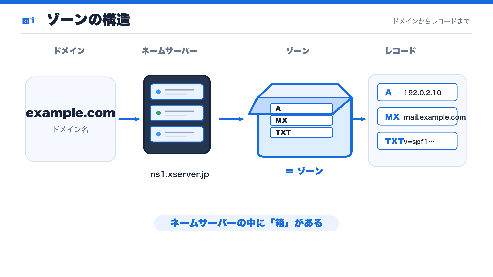
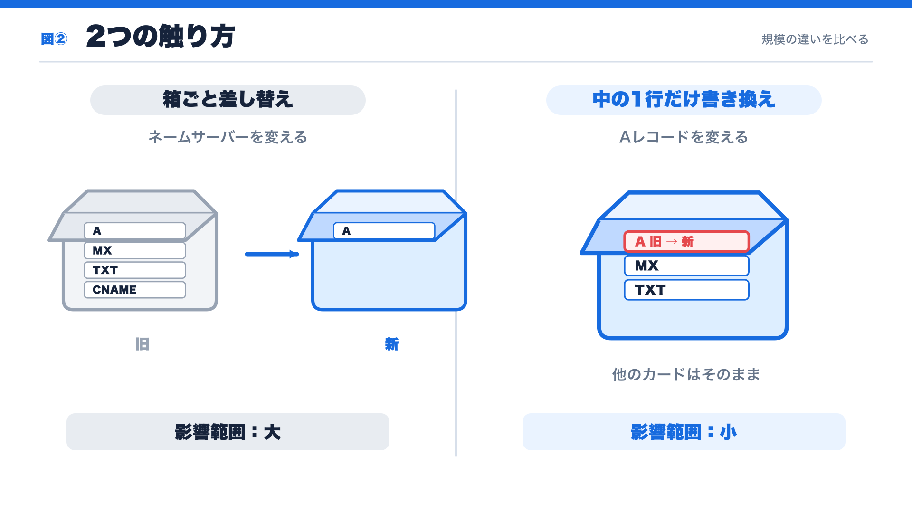
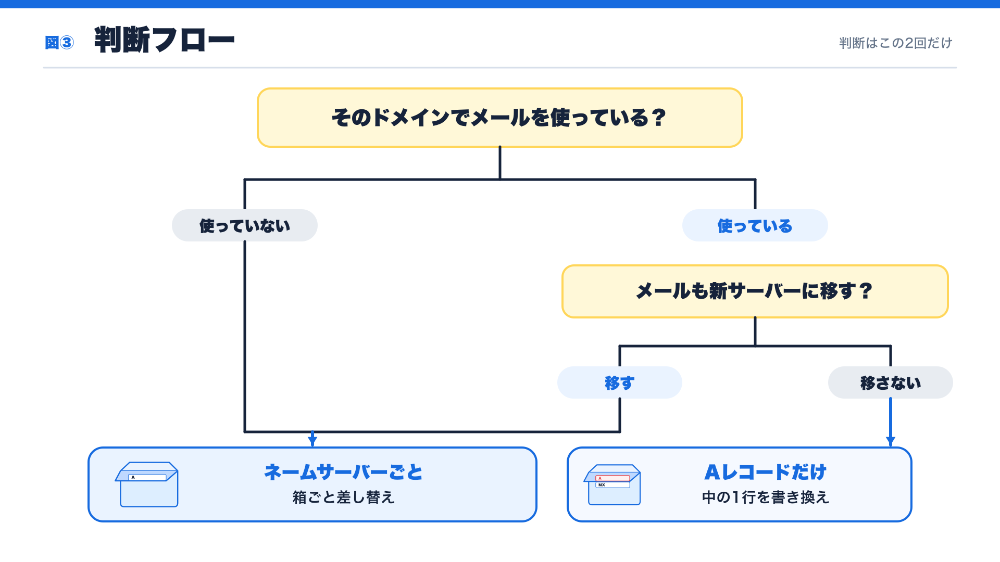
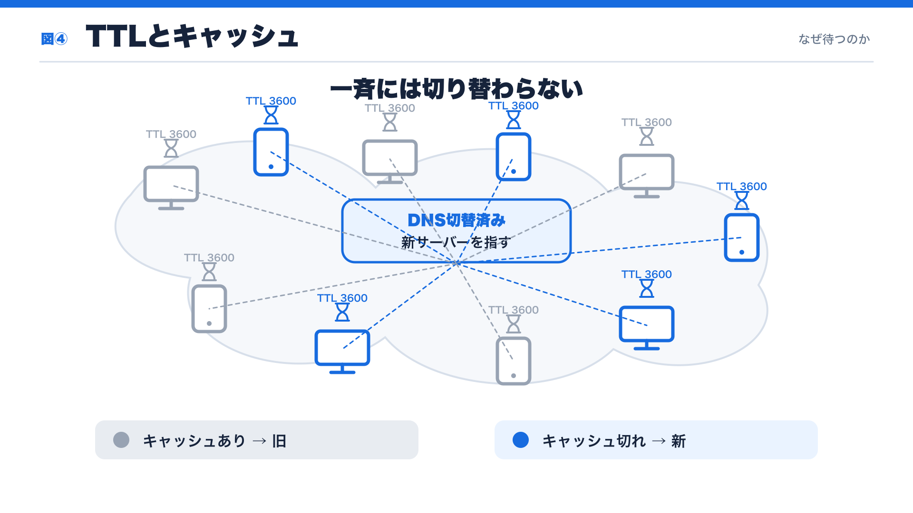
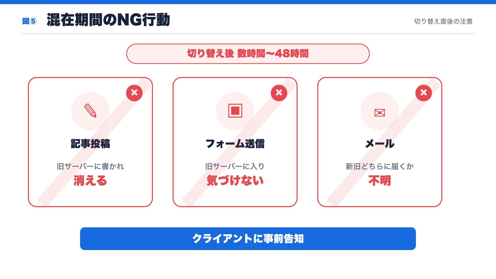
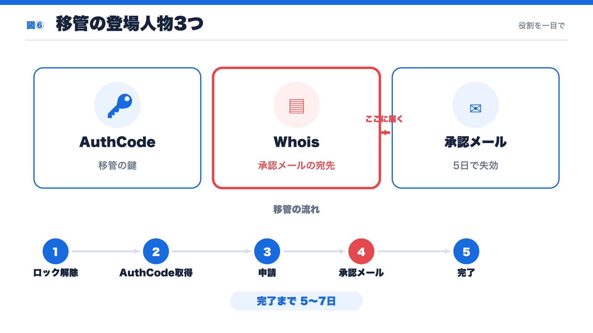
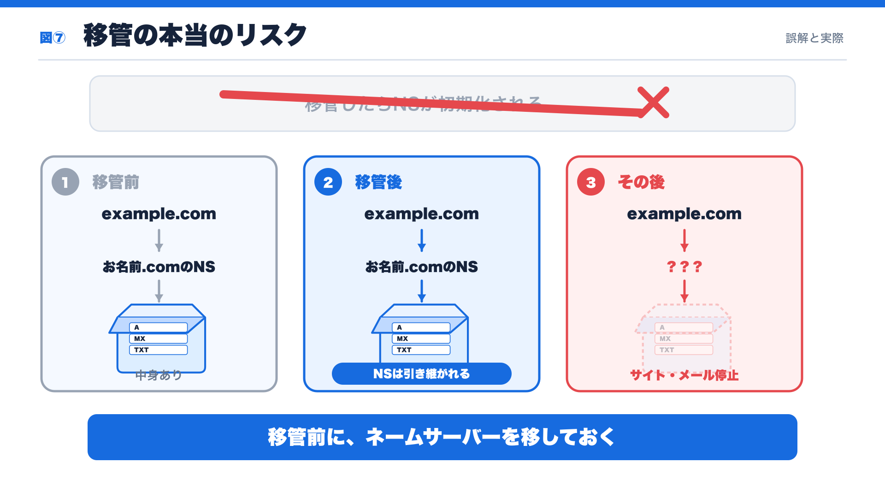
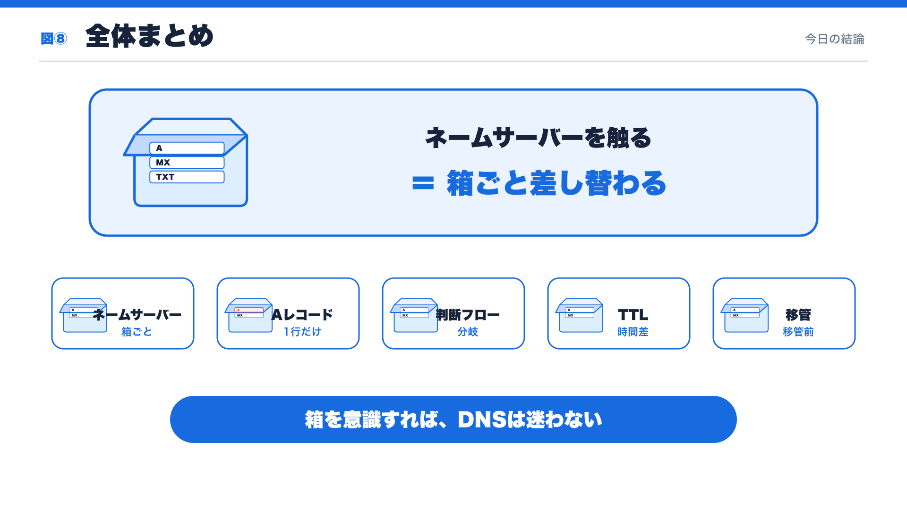

# サーバー引越しセミナー 補修講座

> 作成日: 2026-08-25
> ※本文テキストは未挿入。図①〜⑧の差し込み位置のみ確定済み。

---

## 図①｜ゾーンの構造 — ドメインからレコードまで

<!-- TODO: 本文 -->

> ネームサーバーの中に「箱」がある

---

## 図②｜2つの触り方 — 規模の違いを比べる

<!-- TODO: 本文 -->

> ネームサーバーを変える＝影響範囲：大／Aレコードを変える＝影響範囲：小

---

## 図③｜判断フロー — 判断はこの2回だけ

<!-- TODO: 本文 -->

> 判断は「メールを使っているか」「メールも移すか」の2回だけ

---

## 図④｜TTLとキャッシュ — なぜ待つのか

<!-- TODO: 本文 -->

> キャッシュあり → 旧サーバー／キャッシュ切れ → 新サーバー

---

## 図⑤｜混在期間のNG行動 — 切り替え直後の注意

<!-- TODO: 本文 -->

> 切り替え後 数時間〜48時間はクライアントに事前告知

---

## 図⑥｜移管の登場人物3つ — 役割を一目で

<!-- TODO: 本文 -->

> ロック解除 → AuthCode取得 → 申請 → 承認メール → 完了（5〜7日）

---

## 図⑦｜移管の本当のリスク — 誤解と実際

<!-- TODO: 本文 -->

> 移管前に、ネームサーバーを移しておく

---

## 図⑧｜全体まとめ — 今日の結論

<!-- TODO: 本文 -->

> 箱を意識すれば、DNSは迷わない
